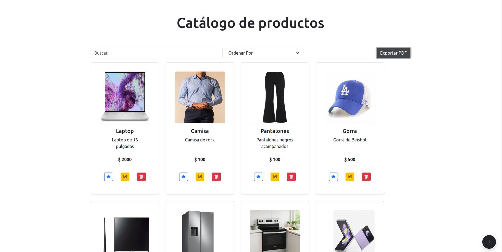

# Examen Front-End – React + TypeScript + Bootstrap 5

### Nombre: Grether Rubí Juanita Alvarado Sarat
Tecnologías utilizadas: React 18 (TSX), TypeScript, Bootstrap 5, React Hook Form, jsPDF, JSON Server

### Instalación y ejecución
#### Clonar el repositorio:

    git clone git@githubcom:Rubi19989Examen.git

    cd examen

#### Instalaciones:
    
    npm install
    

### Iniciar Proyecto

    npm run server

    npm run dev

## Funcionalidades implementadas

Catálogo de productos

CRUD completo (Crear, Leer, Editar, Eliminar)

Formulario con validaciones (React Hook Form + Bootstrap)

Previsualización de imagen antes de crear

Detalle de producto

Listado

Paginación reutilizable

Búsqueda y ordenamiento de productos

Exportación a PDF del listado filtrado/paginado (jsPDF + html2canvas/autotable)

API Mock

JSON Server simula los endpoints del CRUD

db.json contiene al menos 8 productos iniciales

Estilo y UI

Diseño responsive con Bootstrap 5

